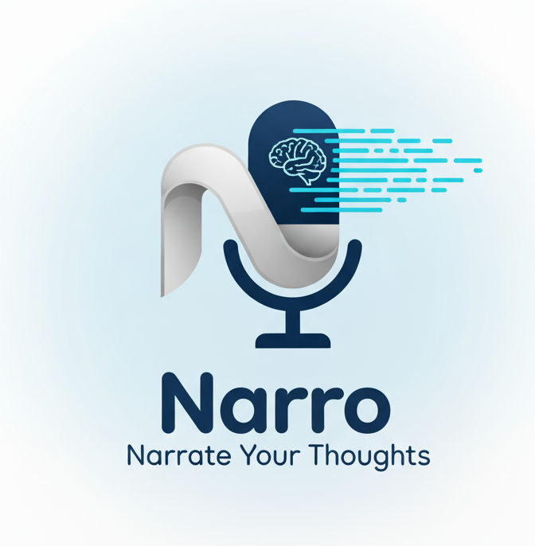

# Narro - Narrate Your Thoughts
<p align="center">
  
  <br>
  <strong>The open-source macOS dictation app that lets you narrate your thoughts into text 🎙️</strong>
</p>

# NOTE:
https://spokenly.app/


***************************************************************************************************
> [!WARNING]
> I am not working on this anymore; I just use this one; it's free and in the Apple Store. https://spokenly.app/
***************************************************************************************************


> 🍴 **Modified fork** of the original [VTS by Josue Julcarima](https://github.com/j05u3/VTS)
>

**Narro** is streamlined for **OpenAI-only transcription** with hold-to-record and other improvements.

## Key Modifications

### ✂️ Removed
- 🚫 Firebase Analytics (all telemetry removed)
- 🚫 Groq and Deepgram provider support
- 🚫 Sparkle auto-update system

### ✨ Added
- 🎤 **Hold-to-Record Mode** (push-to-talk) alongside toggle mode
- 🛠️ Build script for automatic copying to ~/Applications

### 🔧 Fixed
- ✅ OpenAI Realtime API (now uses transcription-only endpoint)
- ✅ Language detection defaults to English
- ✅ Improved transcription accuracy and reliability

---

Transform your voice into text instantly with the power of **OpenAI** API. Say goodbye to macOS dictation limitations and hello to lightning-fast, accurate transcription with your own custom hotkeys! ⚡️

## 📋 Table of Contents

- [Why Choose Narro?](#-why-choose-narro)
- [API Key Setup](#api-key-setup)
- [Usage Guide](#-usage-guide)
  - [Basic Transcription](#basic-transcription)
  - [Advanced Features](#advanced-features)
- [Privacy & Security](#-privacy--security)
- [Troubleshooting](#%EF%B8%8F-troubleshooting)
- [Development](#%E2%80%8D-development)
  - [Requirements](#development-requirements)
  - [Building from Source](#building-from-source)
  - [Building and Releasing DMG](#building-and-releasing-dmg)
  - [Architecture](#architecture)
  - [Contributing](#contributing)
- [License](#-license)
- [Acknowledgements](#-acknowledgements)

## ✨ Why Choose Narro?

- 🤖 **AI-Powered Accuracy**: Leverage OpenAI's powerful transcription models
- 🎤 **Hold-to-Record Mode**: New push-to-talk feature alongside traditional toggle mode
- 🔑 **Your Keys, Your Control**: Bring your own API key - no subscriptions, no limits
- 🔄 **Drop-in Replacement**: Works exactly like macOS dictation, but better!
- ⌨️ **Your Shortcut, Your Rules**: Fully customizable global hotkeys (default: ⌘G)
- 🎯 **Smart Device Management**: Intelligent microphone priority with seamless fallback
- 💬 **Context-Aware**: Custom system prompt boosts accuracy for your specific needs
- 🌐 **English by Default**: Language detection set to English for better accuracy
- 🔓 **100% Open Source**: Full transparency, community-driven, modify as you wish

## API Key Setup

After installing Narro, you'll need an OpenAI API key:

- **OpenAI**: [Get your API key here](https://platform.openai.com/api-keys)

**Requirements:**
- **macOS 14.0+** (Apple Silicon & Intel supported)
- **OpenAI API key** (supports multiple models: whisper-1, gpt-4o-transcribe, gpt-4o-mini-transcribe)

## 📖 Usage Guide

### Basic Transcription
1. **Select Model**: Pick from whisper-1, gpt-4o-transcribe, or gpt-4o-mini-transcribe
2. **Enter API Key**: Paste your OpenAI API key in the secure field
3. **Start Recording**: Press the global hotkey (default: ⌘G) and speak
4. **View Results**: See real-time transcription inserted into the application you're using
5. **(Optional) Copy**: Use buttons to copy the transcript

### Advanced Features

#### Microphone Priority Management
- **View Available Devices**: See all connected microphones with system default indicators
- **Set Priority Order**: Add devices to priority list with + buttons
- **Automatic Fallback**: App automatically uses highest-priority available device
- **Real-time Switching**: Seamlessly switches when preferred devices connect/disconnect
- **Remove from Priority**: Use − buttons to remove devices from priority list

#### Custom System Prompts
- Add context-specific prompts to improve transcription accuracy
- Examples: "Medical terminology", "Technical jargon", "Names: John, Sarah, Mike"
- Prompts help the AI better understand domain-specific language

## 🔒 Privacy & Security

- **No audio storage**: Audio is processed in real-time, never stored locally
- **API keys are safe**: Keys are stored in Keychain
- **TLS encryption**: All API communication uses HTTPS
- **Microphone permission**: Explicit user consent required for audio access

## 🛠️ Troubleshooting

### Common Issues
- **Microphone Permission Denied**: Check System Settings > Privacy & Security > Microphone
- **No Microphones Found**: Click "Refresh" in the Microphone Priority section
- **Wrong Microphone Active**: Set your preferred priority order or check device connections
- **App Not Responding to Hotkey**: Ensure accessibility permissions are granted when prompted

---

## 👩‍💻 Development

*This section is for developers who want to build Narro from source or contribute to the project.*

### Development Requirements
- **macOS 14.0+** (Apple Silicon & Intel supported)
- **Xcode 15+** for building
- **OpenAI API key** for testing

### Building from Source

1. **Clone the repository:**
```bash
git clone https://github.com/d1egoaz/narro.git
cd narro
```

2. **Open in Xcode:**
```bash
open NarroApp.xcodeproj
```

3. **Build and run:**
   - In Xcode, select the **NarroApp** scheme
   - Build and run with **⌘R**
   - Grant microphone permission when prompted

#### Command Line Building

```bash
# Build via command line
xcodebuild -project NarroApp.xcodeproj -scheme NarroApp build
```

### Building and Releasing DMG

For creating distributable DMG packages:

#### Quick Local Build
```bash
# Build unsigned DMG (default - no certificate needed)
./scripts/build-dmg.sh --skip-signing

# OR build with code signing (requires Developer ID certificate)
./scripts/build-dmg.sh
```

#### Creating a Release

The simplest way to release Narro is using the automated release script:

**Prerequisites:**
- Install GitHub CLI: `brew install gh`
- Authenticate: `gh auth login`

**Create a release:**
```bash
# Build, tag, and release (unsigned by default)
./scripts/release.sh v1.2.0

# Or with code signing (if you have a Developer ID certificate)
./scripts/release.sh v1.2.0 --sign
```

This script will:
1. Update version in Info.plist
2. Build the universal DMG (Intel + Apple Silicon)
3. Create a git tag and push it
4. Create a GitHub release with the DMG attached
5. Upload SHA-256 checksums for verification
6. Include installation instructions for unsigned apps

Users can then download the DMG directly from: `https://github.com/d1egoaz/narro/releases`

**Note about unsigned builds:** Without an Apple Developer ID certificate ($99/year), apps are unsigned. Users will need to right-click > Open on first launch. This is standard for open-source macOS applications. The release notes automatically include instructions for users.

### Architecture

Narro follows a clean, modular architecture:

- **CaptureEngine**: Handles audio capture using AVAudioEngine with Core Audio device management
- **DeviceManager**: Manages microphone priority lists and automatic device selection
- **TranscriptionService**: Orchestrates streaming transcription with provider abstraction
- **STTProvider Protocol**: Clean interface allowing easy addition of new providers
- **Modern SwiftUI**: Reactive UI with proper state management and real-time updates

### Testing

Currently, Narro includes manual testing capabilities through the built-in Text Injection Test Suite accessible from the app's interface. This allows you to test text insertion functionality across different applications.

Automated unit tests are planned for future releases.

### Development Troubleshooting

#### Accessibility Permissions (Development)
- **Permission Not Updating**: During development/testing, when the app changes (rebuild, code changes), macOS treats it as a "new" app
- **Solution**: Remove the old app entry from System Settings > Privacy & Security > Accessibility, then re-grant permission
- **Why This Happens**: Each build gets a different signature, so macOS sees it as a different application
- **Quick Fix**: Check the app list in Accessibility settings and remove any old/duplicate Narro entries

#### Testing Onboarding Flow
- **Reset App State**: To test the complete onboarding flow, change the `PRODUCT_BUNDLE_IDENTIFIER` in Xcode project settings
- **Why This Works**: Changing the bundle identifier creates a "new" app from macOS perspective, resetting all permissions and app state
- **Most Reliable Method**: This is more reliable than clearing UserDefaults and ensures a clean onboarding test including all system permissions

### Contributing

See [CONTRIBUTING.md](CONTRIBUTING.md) for details on how to contribute to Narro development.

## 📄 License

MIT License - see [LICENSE](LICENSE) file for details.

## 🙏 Acknowledgements

Narro wouldn't be possible without the incredible work of the open-source community. Special thanks to:
- Original [VTS](https://github.com/j05u3/VTS) by Josue Julcarima - the foundation for this fork
